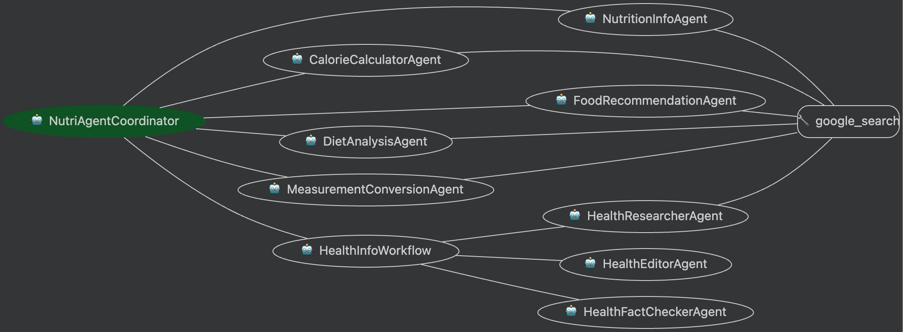

# NutriAgent Multi-Agent System

This directory contains the specialized agents that make up the NutriAgent multi-agent system. The system uses Google's Agent Development Kit (ADK) to create a coordinated network of specialized agents that work together to provide comprehensive nutrition information.

## System Architecture

The NutriAgent system uses a coordinator-specialist pattern:

1. **Coordinator Agent**: Routes user queries to the appropriate specialized agent
2. **Specialized Agents**: Handle specific types of nutrition-related queries

```
                           ┌─────────────────────┐
                           │                     │
                           │  Coordinator Agent  │
                           │                     │
                           └──────────┬──────────┘
                                      │
                                      │ (routes to)
                                      ▼
┌──────────────┬──────────────┬──────────────┬──────────────┬──────────────┬──────────────┐
│              │              │              │              │              │              │
│  Nutrition   │   Calorie    │    Food      │    Diet      │ Measurement  │   Health     │
│    Info      │  Calculator  │Recommendation│   Analysis   │ Conversion   │    Info      │
│    Agent     │    Agent     │    Agent     │    Agent     │    Agent     │  Workflow    │
│              │              │              │              │              │              │
└──────────────┴──────────────┴──────────────┴──────────────┴──────────────┴──────────────┘
```

## Agent Schema

The NutriAgent system implements a sophisticated multi-agent architecture centered around the NutriAgentCoordinator. This coordinator acts as the central hub that intelligently routes user queries to specialized agents based on the query content and intent.

Each specialized agent has access to the google_search tool, enabling them to retrieve real-time nutrition information from the web. This ensures that responses are based on the most current and accurate data available.

The Health Information Workflow represents a sequential process where three specialized agents work in sequence: the HealthResearcherAgent gathers information, the HealthEditorAgent structures and improves the content, and the HealthFactCheckerAgent verifies accuracy and adds appropriate disclaimers.



## Agents Overview

### Coordinator Agent (`coordinator_agent.py`)

The main entry point that analyzes user queries and routes them to the appropriate specialized agent.

### Nutrition Information Agent (`nutrition_info_agent.py`)

Provides detailed nutritional information about specific foods using web search to find the most current and accurate data.

### Calorie Calculator Agent (`calorie_calculator_agent.py`)

Calculates total calories and macronutrients for meals and recipes by looking up nutritional data for each component and performing the calculations.

### Food Recommendation Agent (`food_recommendation_agent.py`)

Recommends foods based on dietary preferences, health goals, and restrictions, providing personalized suggestions with explanations.

### Diet Analysis Agent (`diet_analysis_agent.py`)

Analyzes food logs or meal descriptions and provides constructive feedback on nutritional balance and potential improvements.

### Measurement Conversion Agent (`measurement_conversion_agent.py`)

Converts food measurements between different units, accounting for the specific properties of different foods.

### Health Information Workflow (`health_info_agent.py`)

A sequential workflow of agents that:
1. Researches nutrition-related health conditions (Health Researcher Agent)
2. Improves and structures the content (Health Editor Agent)
3. Verifies the information for accuracy and adds disclaimers (Health Fact Checker Agent)

## Agent Types Used

The system demonstrates several ADK agent patterns:

1. **LLM Agents**: All specialized agents use the `LlmAgent` class for natural language understanding and generation.

2. **Sequential Agent**: The Health Information Workflow uses a `SequentialAgent` to coordinate a multi-step process of research, editing, and fact-checking.

3. **Multi-Agent System**: The overall system is a multi-agent system with the coordinator routing to specialists.

## Tools Used

All agents use the `GoogleSearchTool` to access real-time information instead of relying on static data, enabling them to provide the most current and accurate nutrition information.

## Usage

The agents are designed to be used through the main coordinator. The typical flow is:

1. User sends a query to the system
2. Coordinator analyzes the query and routes to the appropriate specialist
3. Specialist processes the query using web search and its specialized knowledge
4. Response is returned to the user

For example usage, see the main `app/agent.py` file. 